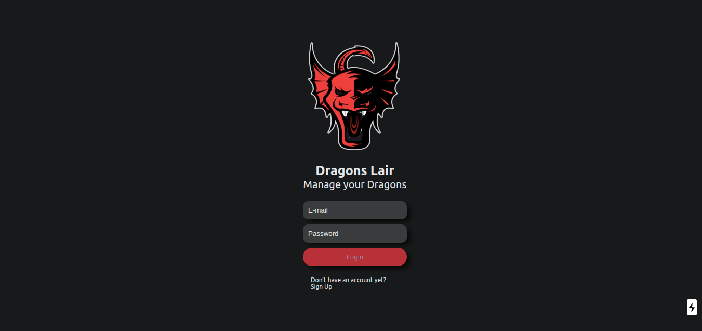
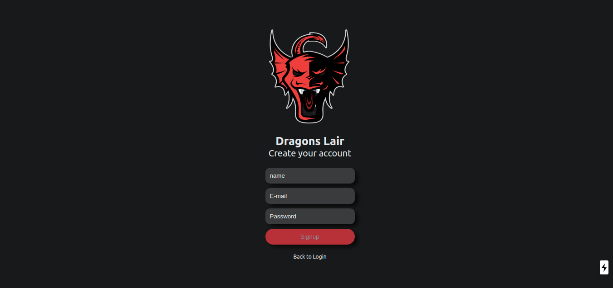
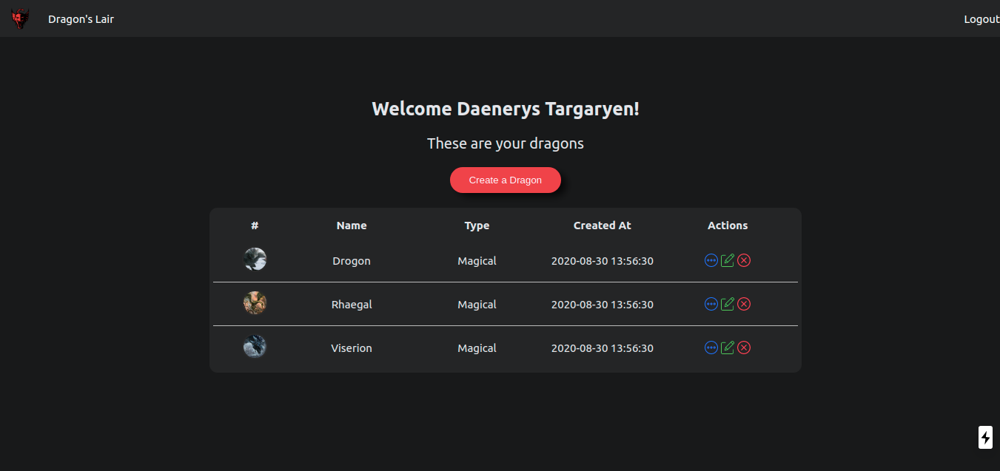
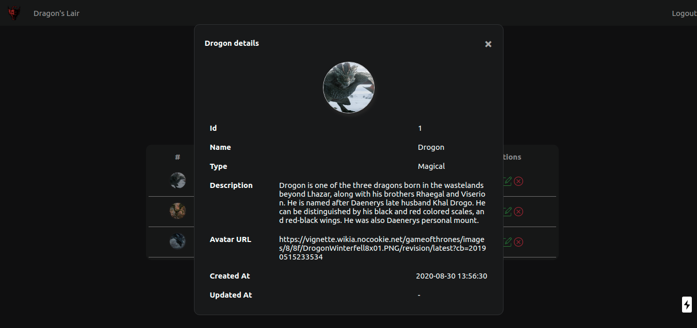
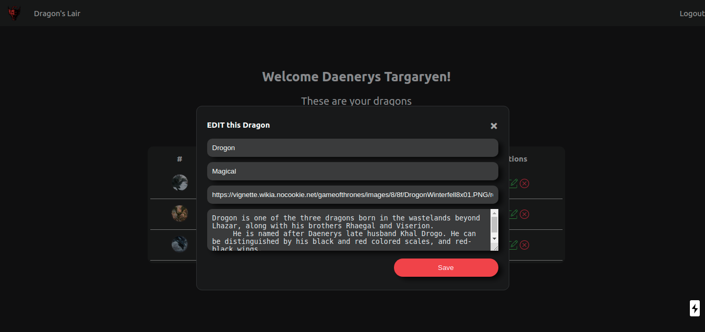
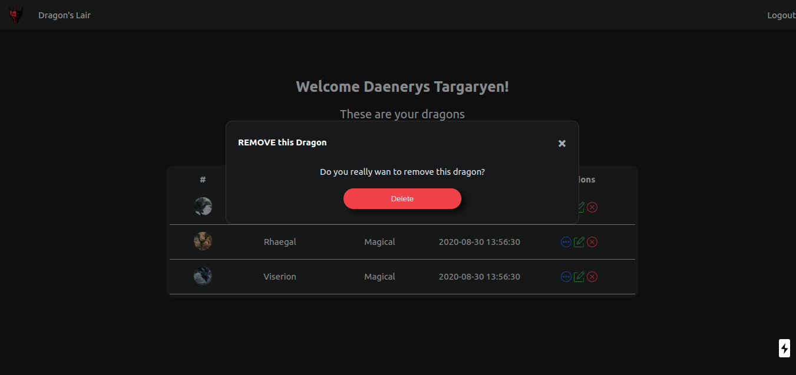
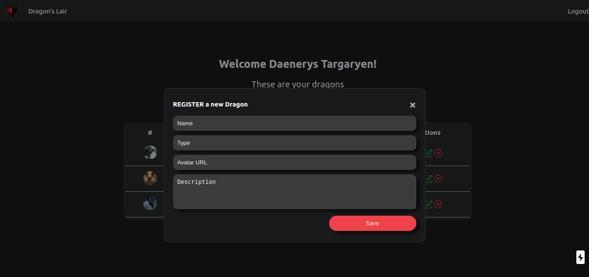

# Dragon's Lair Web App
<span style="display:block;text-align:center"></span>
<span style="display:block;text-align:center">Logo por: [Myles Mendonza](https://dribbble.com/shots/1974858-Dragon-Mascot?utm_source=Clipboard_Shot&utm_campaign=mylesmendoza&utm_content=Dragon%20Mascot&utm_medium=Social_Share)</span>

## Overview

Esse projeto foi contruído utilizando [Next.js](https://nextjs.org/) através do CLI [`create-next-app`](https://github.com/vercel/next.js/tree/canary/packages/create-next-app).

Para construção dos componentes front-end da aplicação foram utilizados:
 - [React](https://reactjs.org/)
 - [TypeScript](https://www.typescriptlang.org/)
 - [Styled Components](https://styled-components.com/) (permite criar CSS em um arquivo JavaScript)
 - [SWR](https://swr.vercel.app/) Hook para sistema de cache em requisições HTTP
 - [Axios](https://github.com/axios/axios) Cliente HTTP


Para o desenvolvimento da API foram utilizados:
 - [sqlite](https://www.npmjs.com/package/sqlite) - banco de dados
 - [jsonwebtoken](https://www.npmjs.com/package/jsonwebtoken) - Autenticação
 - [bcrypt](https://www.npmjs.com/package/bcrypt) - Encriptação das senhas

 Os endpoints resultantes foram: 
 
  - `POST .../api/v1/signup` - cadastro de novo usuário no sistema
  - `POST .../api/v1/login` - login no sistema
  - `GET .../api/v1/user/:id/dragon` - lista de dragões de um usuário
  - `GET .../api/v1/user/:id/dragon/:id` - detalhes de um dragão
  - `POST .../api/v1/user/:id/dragon/:id` - criação de um dragão
  - `PUT .../api/v1/user/:id/dragon/:id` - edição de um dragão
  - `DELETE .../api/v1/user/:id/dragon/:id` - remoção de dragão

## Getting Started

> ### Esse projeto necessita do Node JS na versão 12 ou superior

Primeiro, rode
```bash
yarn install
# or
npm install
```
Depois
```bash
npm run dev
# or
yarn dev
```

Abra [http://localhost:3000](http://localhost:3000) no navegador para ver o resultado.

```bash
# Usuário para teste
> email: daenerys@got.com
> password: test123
```

## Folder Structure

```
📦migrations (Migrações do banco de dados)
 ┣ 001-helloworld.sql
📦src
 ┣ 📂assets (SVG utilizados)
 ┃ ┣ 📜close.svg
 ┃ ┣ 📜edit.svg
 ┃ ┗ 📜more.svg
 ┣ 📂components (Componentes principais)
 ┃ ┣ 📂App (Componentes para telas autenticadas)
 ┃ ┃ ┗ 📂Dragon (Componente principal da listagem de dragões)
 ┃ ┃ ┃ ┣ 📂Details (Modal de detalhes de um dragão)
 ┃ ┃ ┃ ┃ ┣ 📜index.tsx
 ┃ ┃ ┃ ┃ ┗ 📜styles.ts
 ┃ ┃ ┃ ┣ 📂Form (Formulário de Registro, Edição e Remoção de um dragão)
 ┃ ┃ ┃ ┃ ┣ 📜index.tsx
 ┃ ┃ ┃ ┃ ┗ 📜styles.ts
 ┃ ┃ ┃ ┣ 📂Table (Tabela de listagem dos dragões)
 ┃ ┃ ┃ ┃ ┣ 📜index.tsx
 ┃ ┃ ┃ ┃ ┗ 📜styles.ts
 ┃ ┃ ┃ ┣ 📜index.tsx
 ┃ ┃ ┃ ┗ 📜styles.ts
 ┃ ┣ 📂Auth (Componentes para telas não autenticadas)
 ┃ ┃ ┣ 📂Login (Component da página de Login)
 ┃ ┃ ┃ ┗ 📜index.tsx
 ┃ ┃ ┣ 📂Signup (Componente da página de cadatro de usuário)
 ┃ ┃ ┃ ┗ 📜index.tsx
 ┃ ┃ ┗ 📜styles.ts
 ┃ ┣ 📂Button (Componente botão)
 ┃ ┃ ┣ 📜index.tsx
 ┃ ┃ ┗ 📜styles.ts
 ┃ ┣ 📂Input (Componente de Input)
 ┃ ┃ ┣ 📜index.tsx
 ┃ ┃ ┗ 📜styles.ts
 ┃ ┣ 📂Modal (Componente do Modal)
 ┃ ┃ ┣ 📜index.tsx
 ┃ ┃ ┗ 📜styles.ts
 ┃ ┣ 📂Textarea (Componente Textarea)
 ┃ ┃ ┣ 📜index.tsx
 ┃ ┃ ┗ 📜styles.ts
 ┃ ┗ 📂ToolBar (Component da barra do topo)
 ┃ ┃ ┣ 📜index.tsx
 ┃ ┃ ┗ 📜styles.tsx
 ┣ 📂contexts (React Contexts)
 ┃ ┗ 📜auth.tsx (Contexto utilizado para manter os dados do usuário logado)
 ┣ 📂pages (Resposável pela API e pelas rotas do front-end)
 ┃ ┣ 📂api (Pasta para as rotass da API)
 ┃ ┃ ┗ 📂v1
 ┃ ┃ ┃ ┣ 📂user (Rotas do usuário)
 ┃ ┃ ┃ ┃ ┣ 📂[uid]
 ┃ ┃ ┃ ┃ ┃ ┗ 📂dragon (Rotas dos dragões por usuário)
 ┃ ┃ ┃ ┃ ┃ ┃ ┣ 📜[did].ts
 ┃ ┃ ┃ ┃ ┃ ┃ ┗ 📜index.ts
 ┃ ┃ ┃ ┃ ┗ 📜me.ts (GET para dados do usuário)
 ┃ ┃ ┃ ┣ 📜login.ts (Rota de Login da API)
 ┃ ┃ ┃ ┗ 📜signup.ts (Rota de Signup da API)
 ┃ ┣ 📂dragon (Rotas Front-End da página dos dragões)
 ┃ ┃ ┗ 📜index.tsx
 ┃ ┣ 📜_app.tsx
 ┃ ┣ 📜_document.tsx
 ┃ ┣ 📜index.tsx (Rotas Front-End da página de Login)
 ┃ ┗ 📜signup.tsx (Rotas Front-End da página de Signup)
 ┣ 📂services (Hooks customizados)
 ┃ ┗ 📜api.ts (Hooks para comunicação com a API)
 ┗ 📂styles
 ┃ ┗ 📜global.ts (Estilos globais aplicados em todas as páginas)
```

## Screenshots
### Login

### Signup

### Dragon Page

### Dragon Details

### Dragon Edit

### Dragon Remove

### Dragon Register
